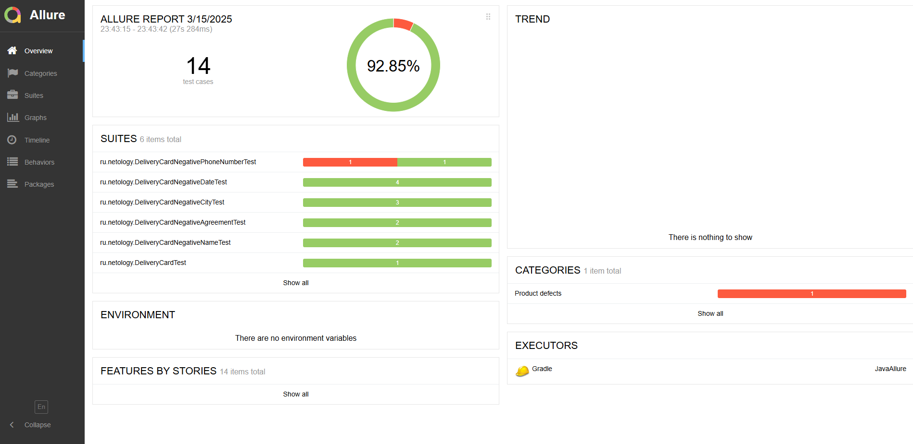
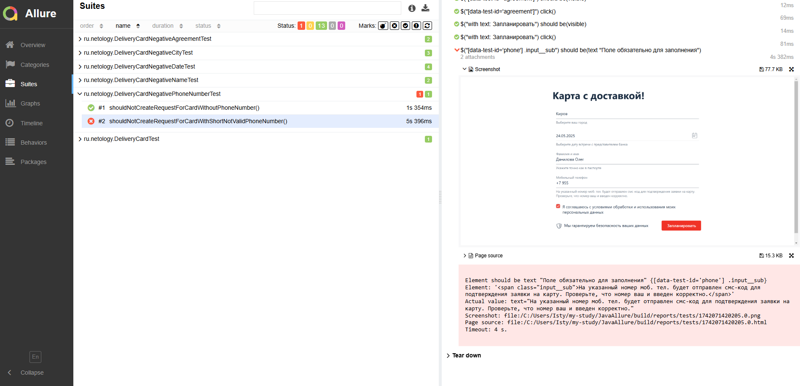

### Домашнее задание к занятию «4.1. Репортинг»



### Задача №1: проснулись (Allure)

В одном из предыдущих проектов **Patterns** вы тестировали функциональности заказа карт.

Ваше руководство узнало на конференции про такой замечательный инструмент, как Allure, который позволяет делать репортинг более наглядным и требует от вас интегрировать его в ваши тесты.

Начать решили именно с функции доставки карт:


Вам нужно:   
* взять ваш проект (см. «Как сдавать задачи») и прикрутить туда Allure, интегрированный с 
<details>

Добавить в файл ```build.gradle```:

```
plugins {

    id 'io.qameta.allure' version '2.11.2'
}

allure {
    version = '2.20.1'
    useJUnit5 {
        version = '2.20.1'
    }
}

dependencies {

    testImplementation 'io.qameta.allure:allure-selenide:2.20.1'
}
```

Добавить в файл с тестом:

```
    @BeforeAll
    static void setUpAll() {
        SelenideLogger.addListener("allure", new AllureSelenide());
    }

    @AfterAll
    static void tearDownAll() {
        SelenideLogger.removeListener("allure");
    }
```

</details>

* удостоверится, что при локальном запуске всё работает, отчёты генерируются.
* запустить отчет allure с помощью команды ```.\gradlew allureserve ```
* приложить в файл README репозитория скриншоты отчета Allure.
* оформить issue на найденный баг


